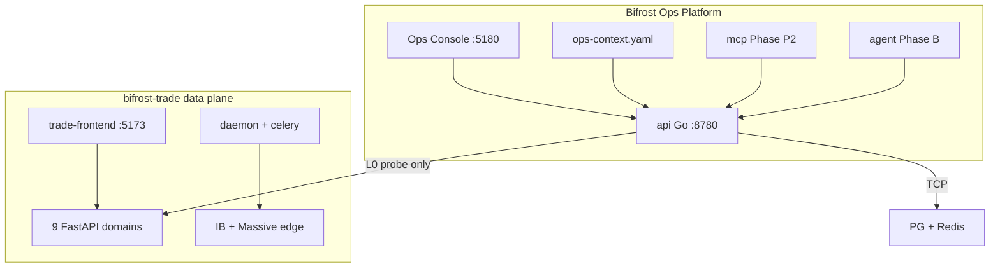
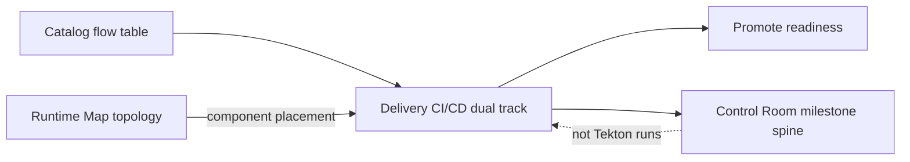
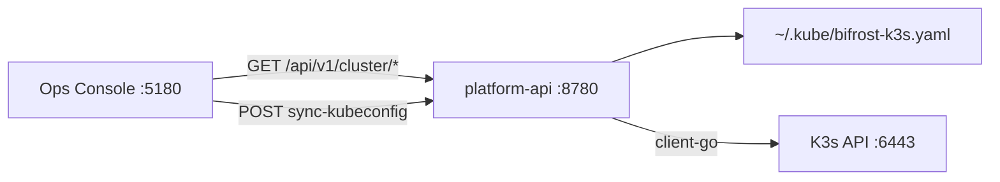

# bifrost-platform Architecture

## North star (ultimate goal)

**Strategy C — hybrid single pane.** All routine environment, cluster, release, and ops actions go through **Bifrost Ops Console** and **platform-api**; infra scripts run only as **API executors**. The Owner's only out-of-band action is **restarting the Ops Platform** itself.

Authoritative: [NORTH_STAR.md](NORTH_STAR.md) · spine `config/ops-context.yaml` → `north_star` · decision **D6** · Program → Milestones · milestone **ops-ui-actuation**.

## Control plane vs data plane

## Ops Console views (flywheel UI)

| View | Plane | Purpose |
|------|-------|---------|
| **Control Room** | Governance | **Default Ops entry** — dual flywheel bays, program milestone spine, Agent focus dock |
| **Delivery** | PLAN + LIVE | **CI/CD dual track** — near-term Mac runner vs target GitOps; coupling gate summary |
| **Runtime Map** | LIVE + PLAN | **Unified runtime** — hardware topology + SCOPE stack + matrix probes |
| **Cluster** | LIVE | **K3s L0 probe** — nodes, namespaces, workloads via platform-api + local kubeconfig |
| Pulse | LIVE + focus | Table dashboard — matrix summary + spine headline + cluster KPI |
| **Milestones** | TRACK + PLAN | Milestones, decisions D1–Dn, **north star**, roadmap (ops-context spine) |
| Promote | Coupling | Read-only release readiness (flywheel A + B) |
| Catalog | PLAN static | End-to-end flows with status + Copy for LLM |
| Tools | B | Server console (SSH/WebSocket) |

**Delivery** (`console/src/lib/delivery/`) renders a static **Now** lane (Mac CI → release gate → compose prod) and **Target** lane (Gitea → Tekton → ArgoCD → K3s). Node status is derived client-side from `ops-context` (L0). **Control Room** milestone spine tracks migration/cutover milestones — not CI build runs.

**Control Room** aggregates `GET /api/v1/context` + `GET /api/v1/matrix` on the client. **Runtime Map** merges `GET /api/v1/topology` + per-env matrix + `environments-catalog` SCOPE layers. **Cluster** uses `GET /api/v1/cluster/*` (client-go + `PLATFORM_KUBECONFIG`); Console never dials `:6443` directly.

### Cluster page (L0)

| Piece | Location | Role |
|-------|----------|------|
| `config/clusters.yaml` | platform config | Registered cluster id, API server, Bifrost namespaces |
| `api/internal/cluster` | Go | client-go probe, kubeconfig sync via `fetch-kubeconfig.sh` |
| `ClusterPage` | `console/src/pages/` | Health strip, nodes, namespaces, workloads, pod drawer |
| `FocusStrip` / `Pulse` / `HostBay` | console | Cluster KPI + Runtime Map **Live** badge on mini-pc-c |

Write actions (rollout restart, ArgoCD sync) — **Phase 2** (L1/L2); P0 is read-only.

### Runtime Map visualization (InfraMapCanvas)

The **left panel** renders physical infrastructure as an **SVG + HTML overlay** canvas (`InfraMapCanvas`), not xyflow:

| Piece | Location | Role |
|-------|----------|------|
| `infraMapLayout.ts` | `console/src/lib/runtime-map/` | Grid → pixel rects, Bézier `pipePath`, edge anchors |
| `infraVisualRegistry.ts` | same | Role → component chips, brand colors, `simple-icons` slugs, SCOPE defaults |
| `InfraMapCanvas` | `console/src/components/runtime-map/` | Edges (probe-colored), host bays, Compose/K3s segment |
| `HostBay` / `StackChip` | same | Per-host stack chips with `ComponentIcon` logos |
| `RuntimeSoftwarePanel` | same | SCOPE groups share the same visual registry icons |

**Boundary with Trade Reactor:** Ops Runtime Map = **hosts + data paths + matrix probes** (from `topology.yaml`). Trade **ServiceTopologyOverview** = **business process graph** (APIs, Celery, daemon). They stay separate; chip click on `api-*` targets can deep-link to Trade frontend.

**Selection model:** `node` | `edge` | `target` | `scope` — edge/chip clicks highlight linked hosts and open `RuntimeMapDrawer` detail.

**UI-3c UX layer** (console-only):

| Piece | Role |
|-------|------|
| `RuntimeHealthStrip` | Top KPI bar — ok/fail/worst target/affected hosts; click fail drills into selection |
| `runtimeMapHealth.ts` | Fail-first helpers (`getFailingTargets`, `layerHasFailingTarget`, …) |
| Icon tokens (`--infra-icon-chip/scope/tile/well`) | Chip 20px / scope 24px / tile 28px in `ComponentIcon` wells |
| `infraMapLayout` `dataPath` mode | Semantic grid overrides for prod app → PG → IB readability |
| Orthogonal edges + collapsed self-loops | No SVG loops; `Local: Redis` badges in `HostBay` |
| HostBay tile mode | Default icon tiles; full `StackChip` when selected/highlighted |
| Fail-first `RuntimeSoftwarePanel` | Hides non-failing SCOPE layers until "Show all layers" |
| Drawer auto-open | Selection opens drawer until user dismisses (`userDismissedDrawer`) |

## Authorization levels

| Level | Platform behavior |
|-------|-------------------|
| L0 | Read-only probes (Phase 0 default) |
| L1 | Safe retries via trade Ops API (future) |
| L2 | Owner-confirmed changes (future) |
| forbidden | Trade write paths — never exposed to platform AI |

## API endpoints

| Path | Description |
|------|-------------|
| `GET /health` | Platform API health |
| `GET /api/v1/context` | Ops spine (milestones, decisions, focus) |
| `GET /api/v1/matrix` | Connectivity matrix |
| `GET /api/v1/topology` | Network topology + live status |
| `GET /api/v1/cluster` | K3s cluster summary (reach, nodes, failing pods) |
| `GET /api/v1/cluster/nodes` | Node list |
| `GET /api/v1/cluster/namespaces` | Namespaces (`?watch=bifrost` filters planning ns) |
| `GET /api/v1/cluster/workloads?ns=` | Pods in namespace |
| `GET /api/v1/cluster/events?ns=&limit=` | Recent events |
| `POST /api/v1/cluster/sync-kubeconfig` | Run `fetch-kubeconfig.sh` (requires `PLATFORM_CLUSTER_SYNC_ENABLED=1`) |

## Ports

| Service | Port |
|---------|------|
| platform-api | 8780 |
| Bifrost Ops Console | 5180 |
| bifrost-trade-frontend | 5173 |

## Configuration

| File | Role |
|------|------|
| `config/environments.yaml` | Dev/prod probe targets |
| `config/ops-context.yaml` | **Spine** — milestones, decisions, focus |
| `config/topology.yaml` | Hardware graph |
| `config/clusters.yaml` | K3s cluster registry + Bifrost namespaces |

Optional Ops token env vars for capabilities probe — see [`.env.example`](../.env.example).

## Related

- [AGENT_MODES.md](AGENT_MODES.md) — Product / Ops / Promote discipline
- [TRADE_CONTRACT.md](TRADE_CONTRACT.md)
- [bifrost-trade-infra Goal/AI_NATIVE_OPS_PLATFORM.md](../../bifrost-trade-infra/Goal/AI_NATIVE_OPS_PLATFORM.md)
