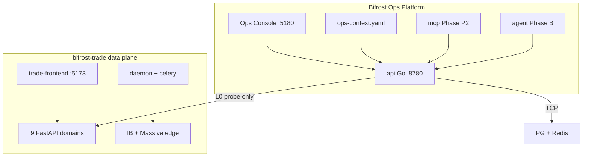

# bifrost-platform Architecture

## Control plane vs data plane

## Ops Console views (flywheel UI)

| View | Plane | Purpose |
|------|-------|---------|
| **Control Room** | Governance | **Default entry** — dual flywheel bays, release pipeline (@xyflow), coupling gate, Agent focus dock |
| Pulse | LIVE + focus | Table dashboard — matrix summary + spine headline |
| Runtime | LIVE | Topology + connectivity matrix |
| Program | TRACK + PLAN | Milestones, decisions D1–Dn, roadmap |
| Promote | Coupling | Read-only release readiness (flywheel A + B) |
| Catalog | PLAN static | Hardware catalog + Copy for LLM |
| Tools | B | Server console (SSH/WebSocket) |

**Control Room** aggregates `GET /api/v1/context` + `GET /api/v1/matrix` on the client (no new Go API in UI-3 v1). Trade [Reactor Map](http://127.0.0.1:5173) remains the flywheel A business topology; Control Room covers governance, release sequence, and Agent context packs.

## Authorization levels

| Level | Platform behavior |
|-------|-------------------|
| L0 | Read-only probes (Phase 0 default) |
| L1 | Safe retries via trade Ops API (future) |
| L2 | Owner-confirmed changes (future) |
| forbidden | Trade write paths — never exposed to platform AI |

## API endpoints

| Path | Description |
|------|-------------|
| `GET /health` | Platform API health |
| `GET /api/v1/context` | Ops spine (milestones, decisions, focus) |
| `GET /api/v1/matrix` | Connectivity matrix |
| `GET /api/v1/topology` | Network topology + live status |

## Ports

| Service | Port |
|---------|------|
| platform-api | 8780 |
| Bifrost Ops Console | 5180 |
| bifrost-trade-frontend | 5173 |

## Configuration

| File | Role |
|------|------|
| `config/environments.yaml` | Dev/prod probe targets |
| `config/ops-context.yaml` | **Spine** — milestones, decisions, focus |
| `config/topology.yaml` | Hardware graph |

Optional Ops token env vars for capabilities probe — see [`.env.example`](../.env.example).

## Related

- [AGENT_MODES.md](AGENT_MODES.md) — Product / Ops / Promote discipline
- [TRADE_CONTRACT.md](TRADE_CONTRACT.md)
- [bifrost-trade-infra Goal/AI_NATIVE_OPS_PLATFORM.md](../../bifrost-trade-infra/Goal/AI_NATIVE_OPS_PLATFORM.md)
