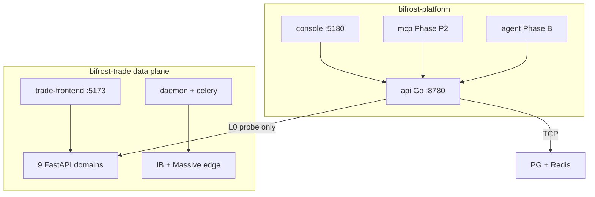

# bifrost-platform Architecture

## Control plane vs data plane

## Authorization levels

| Level | Platform behavior |
|-------|-------------------|
| L0 | Read-only probes (Phase 0 default) |
| L1 | Safe retries via trade Ops API (future) |
| L2 | Owner-confirmed changes (future) |
| forbidden | Trade write paths — never exposed to platform AI |

## Ports

| Service | Port |
|---------|------|
| platform-api | 8780 |
| platform-console | 5180 |
| bifrost-trade-frontend | 5173 |

## Configuration

Environment registry: [`config/environments.yaml`](../config/environments.yaml)

Optional Ops token env vars for capabilities probe — see [`.env.example`](../.env.example).

## Related

- [TRADE_CONTRACT.md](TRADE_CONTRACT.md)
- [bifrost-trade-infra Goal/AI_NATIVE_OPS_PLATFORM.md](../../bifrost-trade-infra/Goal/AI_NATIVE_OPS_PLATFORM.md)
