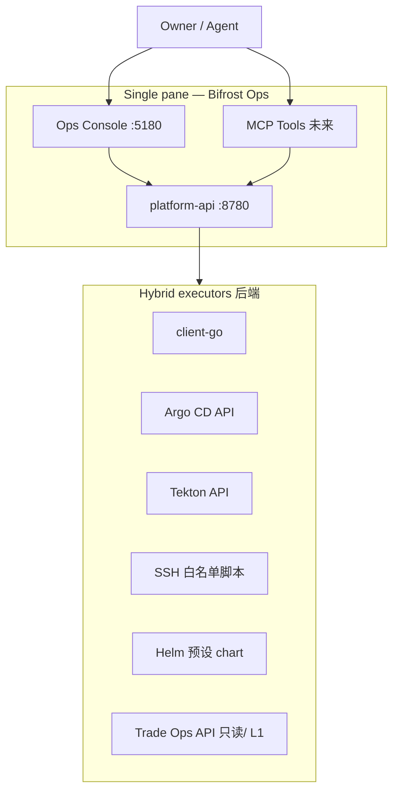

# Bifrost Ops Platform — North Star (终极目标)

> **Status**: Owner-signed (decision D6) · **Strategy**: C — Hybrid control plane  
> **Spine**: `config/ops-context.yaml` → `north_star` · **UI**: Program → Milestones

---

## 一句话

**除重启 Ops Platform 本身以外，所有环境、集群、发布与运维操作都通过 Bifrost Ops Console 与 platform-api 完成**；脚本与第三方工具作为**后端执行器**藏在 API 之后，为人类与 AI Agent 提供**同一套、可审计、可生成 LLM 上下文**的交互面。

---

## Owner 例外（唯一允许在 UI 外做的事）

| 允许 | 不允许（应通过 Ops UI/API 完成） |
|------|----------------------------------|
| 启动 / 重启 `bifrost-platform`（`make start`、升级 control plane） | `kubectl`、`ssh`、`make k3s-*`、手改集群、手跑 `release_gate.sh` |
| 首次安装 Go/Node、克隆 repo（冷启动） | 日常探针、发布、节点 join、Pod 重启、Argo sync |
| 编辑 `ops-context.yaml` / Goal（Owner 战略变更） | 绕过 platform-api 直接调 Trade 写路径 |

---

## Strategy C — 混合方案

不从零复刻整个 K8s 生态，也不把运维人员赶到五六个独立 URL。

| 层 | 职责 |
|----|------|
| **Ops Console** | 统一导航、确认流、审计展示、Copy-for-LLM / Agent packs |
| **platform-api** | 鉴权 L0/L1/L2、作业队列、审计日志、**禁止任意 shell** |
| **成熟组件** | Argo CD、Tekton、Headlamp/Rancher 能力等 — **经 API 封装或深链**，不替代控制面 |
| **infra 脚本** | `install-server.sh`、`fetch-kubeconfig.sh` 等 — **仅作为 executor 实现**，Operator 不手跑 |

---

## 设计原则（Agent 与人类共用）

1. **Single pane** — 交互入口只有 Ops Console + `GET/POST /api/v1/*`（未来 MCP 同契约）。
2. **Scripts are implementation** — 仓库里的 sh/Makefile 是 API 调用的实现细节，不是操作手册。
3. **Graduated actuation** — L0 诊断 → L1 安全重试 → L2 Owner 确认；全部留审计。
4. **LLM-ready context** — 每次操作产生结构化 `action / target / status / detail`，可进入 spine 与 Agent pack。
5. **Forbidden unchanged** — `daemon_control` 写、`ib:operator:cmd`、R-DV3 自动下单绕过（见 `docs/AGENT_MODES.md`）。

---

## 成功标准（完成态）

- [ ] Cluster：节点 join/drain、namespace、workload restart/scale/logs — **仅 UI/API**
- [ ] Delivery：Tekton run、Argo sync/rollback — **仅 UI/API**
- [ ] Promote：`release_gate` 触发与结果 — **仅 UI/API**
- [ ] Runtime Map / Pulse / FocusStrip — 可点击跳转到**可执行**动作，而非只读
- [ ] `GET /api/v1/context` + Program 页始终展示本 north star
- [ ] MCP Tools 与 UI **同权限、同审计**（AI Agent 自我交互闭环）

---

## 分阶段路线（与 `platform_phases` 对齐）

| 阶段 | 交付 | 消灭的手动操作 |
|------|------|----------------|
| **P0**（当前） | Cluster L0 探针、Delivery 双轨展示 | 仅观测 |
| **P1** | Auth + audit + workload L1 + logs | 日常 `kubectl` |
| **P2** | 节点生命周期 job + Cluster UI 向导 | `install-server.sh`、join、drain |
| **P3** | GitOps + CI 执行（Argo/Tekton API） | Argo UI、tkn CLI |
| **P4** | Platform stack 安装向导 | Helm 手装 |
| **P5** | MCP actuation Tools | Agent 直连 shell |

里程碑 id：`ops-ui-actuation`（`ops-context.yaml`）。

---

## 相关文档

- [ARCHITECTURE.md](ARCHITECTURE.md) — 控制面 vs 数据面
- [AGENT_MODES.md](AGENT_MODES.md) — Product / Ops / Promote
- [TRADE_CONTRACT.md](TRADE_CONTRACT.md) — L0 探针契约
- [bifrost-trade-infra/Goal/AI_NATIVE_OPS_PLATFORM.md](../../bifrost-trade-infra/Goal/AI_NATIVE_OPS_PLATFORM.md) — 上层 Goal

---

*Signed: Owner decision D6 · 2026-06-15*
